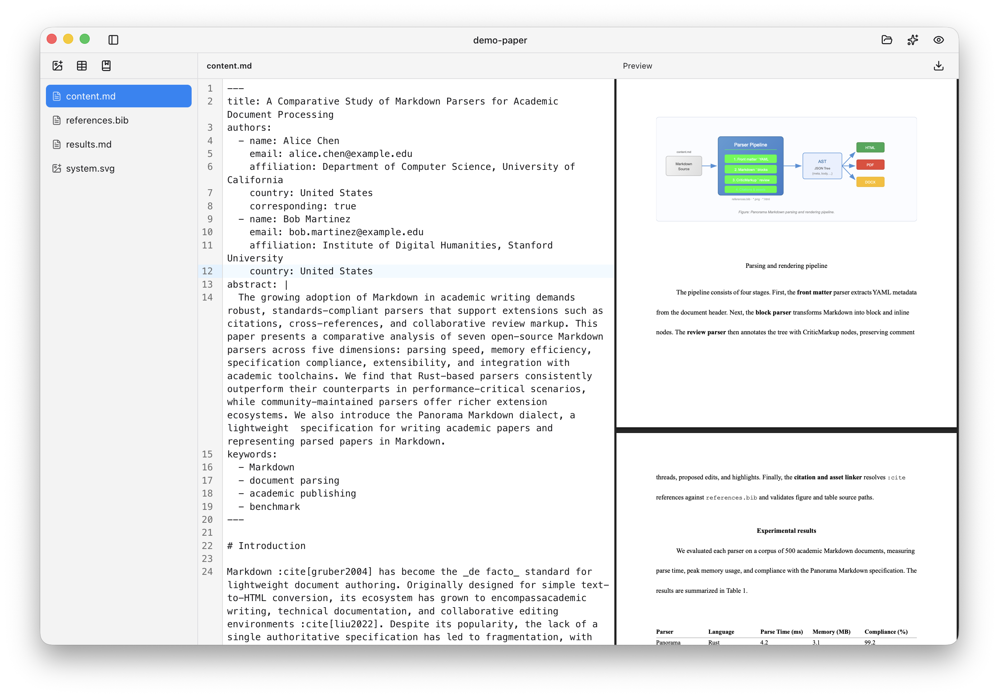

# Panorama Markdown

> [!NOTE]
> Panorama Markdown is preview software, and feedback is very welcome.

Panorama Markdown is a lightweight dialect for writing academic papers and representing parsed PDF papers in Markdown.

It is designed to be friendly to LLMs while staying simple and comfortable for people to write.

## Built on Markdown

- **Standard Markdown** for headings, paragraphs, lists, links, footnotes, and emphasis
- **YAML front matter** for titles, authors, abstracts, and keywords
- **Citations** via `:cite` and a `::references` block backed by BibTeX
- **Figures and tables** are imported with directive syntax instead of embedded directly in the Markdown
- **Cross-references** via `:ref` to labeled sections, figures, and tables

## Specification

The specification is still in progress, but the current format is documented and ready to explore.

Each paper lives in a flat directory of files. The full directory layout and Markdown syntax are defined in **[SPEC.md](SPEC.md)**.

## Typesetting

Markdown defines the content, while layout and styling stay separate. The current tooling can export APA-style PDFs, with support for additional styles planned.

## Editor

Download the latest editor build from the [GitHub releases page](https://github.com/panorama-lab/markdown/releases).

After downloading, open or create a paper directory to start editing and exporting PDFs. Use the Agent button in the top-right to copy prompts to your agent (Codex, Claude) and collaborate directly from the agent.

## Community

- Report bugs, ask questions, or request features on [GitHub Issues](https://github.com/panorama-lab/markdown/issues)
- Join the [Discord server](https://discord.gg/PtgNPuHMFs) to share feedback and discuss the project

## License

Apache 2.0
